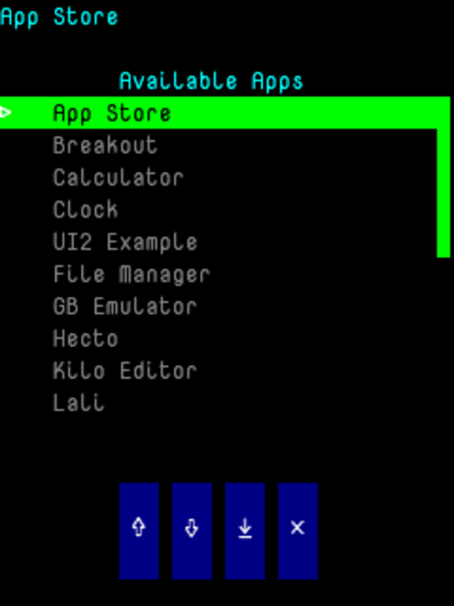
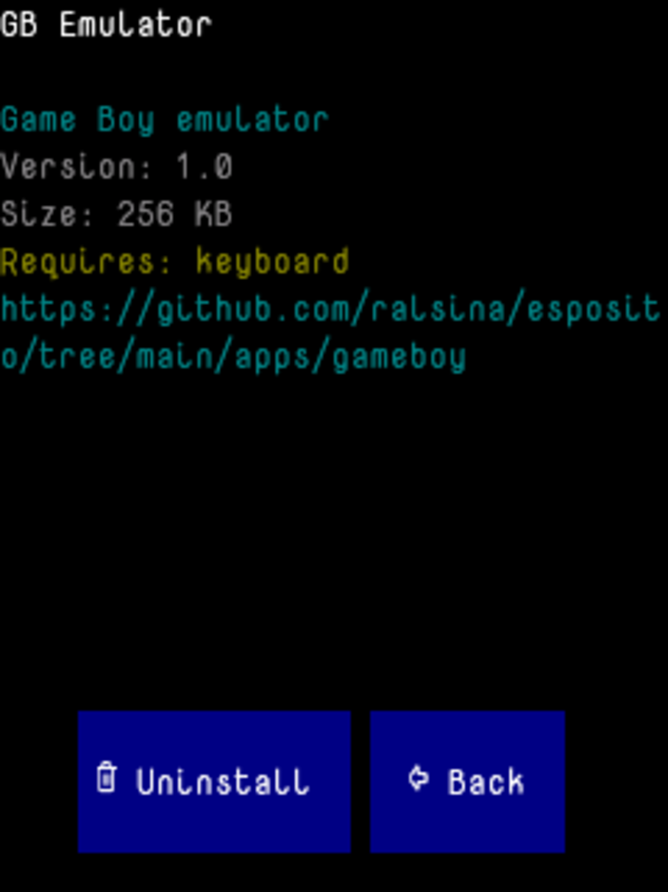

# App Store

Browse, install, and uninstall apps directly on the device. Fetches a catalog of available apps from `esposito.ralsina.me`, shows details and hardware requirements, and handles the full install/uninstall lifecycle.

## Screenshots

| App list with status indicators | App detail with toolbar |
|---|---|
|  |  |

## How it works

- Catalog is cached on the SD card for 24 hours
- Apps are downloaded as ELF binaries and placed in `/sdcard/apps/<id>/program.elf`
- A `manifest.cfg` is written alongside each installed app
- Status symbols: `+` new, `~` update available, ` ` installed
- Missing hardware (keyboard, touch, wifi, etc.) shows a warning but does not block installation

## Controls

- **Touch**: tap list items, toolbar buttons
- **Keyboard**: arrows to navigate, Enter to open, Y/U to install/uninstall, ESC to go back
